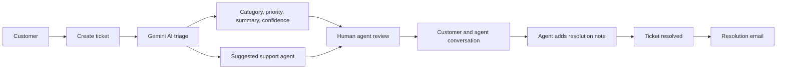

# SupportFlow

> AI-assisted customer support ticket management for faster triage, clearer ownership, and human-led resolution.

SupportFlow is a hackathon-built customer support application. Customers submit tickets and track their progress, while support agents review AI-generated triage suggestions, communicate with customers, and resolve assigned tickets. Administrators supervise agents, tickets, settings, activity, and dashboard analytics.

AI is used to reduce the manual work at the start of the support workflow. It analyzes a new ticket, suggests a category, priority, summary, and suitable agent, and records the suggestions for human review. Agents remain responsible for reviewing the suggestions and handling the customer conversation.

## Features

- Customer registration with email OTP verification
- Customer, support-agent, and administrator roles
- Login, logout, refresh-token sessions, and protected API access
- Customer ticket creation, listing, searching, detail viewing, and activity history
- AI ticket triage using Google Gemini
- AI category and priority suggestions
- AI-generated ticket summary and confidence score
- AI-suggested support-agent assignment with an assignment reason
- Agent review and editing of AI category, priority, and assigned agent
- Agent assigned-ticket dashboard and ticket filters
- Customer and agent ticket conversations
- Real-time Socket.IO messages and typing indicators
- Real-time new-message notifications
- Ticket resolution with a required resolution note
- Resolution email notifications
- Admin agent creation and activation/deactivation
- Admin ticket management and customer ticket history
- Dashboard analytics, ticket distributions, agent performance, and recent activities
- Role-aware frontend routes and backend authorization middleware
- Dark/light theme support in the frontend

## How It Works



1. A customer registers, verifies their email, and signs in.
2. The customer creates a ticket with a subject, description, category, and urgency.
3. The backend sends the ticket information to Gemini for triage.
4. Gemini returns category, priority, summary, and confidence, then selects from eligible active agents in the matching category.
5. The ticket stores the AI suggestions and assignment information.
6. An agent reviews or edits the AI category, priority, and assigned agent.
7. The customer and authorized support participants exchange messages through HTTP and Socket.IO.
8. The assigned agent resolves the ticket with a resolution note.
9. SupportFlow sends resolution emails to the customer and assigned agent.
10. Admin and customer activity/analytics views reflect the resulting ticket data.

## AI Functionality

### Triage

SupportFlow uses the Google GenAI SDK and the `gemini-2.5-flash` model. For triage, the backend provides the ticket subject, description, customer-selected category, and customer-selected urgency. Gemini is requested to return JSON containing:

- `category`
- `priority`
- `summary`
- `confidence`

The request uses an application-defined response schema, `responseMimeType: "application/json"`, and temperature `0`. The parsed values are stored on the ticket as AI suggestions, including `aiSuggestedCategory`, `aiSuggestedPriority`, `aiSummary`, and `aiConfidence`.

### Agent assignment

After triage, the backend finds active agents whose category matches the AI-suggested category. Gemini receives the ticket context and the eligible agent list and returns an `agentId` plus a `reason`. The selected ID must match one of the eligible active agents before it is stored as `aiSuggestedAgent` and used for assignment.

### Human review and error behavior

Agents and administrators with agent-level access can review category, priority, and assigned-agent suggestions through the AI review endpoint. The backend validates the category, priority, and selected active agent before saving the reviewed values.

AI output is parsed as JSON and checked for required fields. If the AI request fails, returns invalid JSON, returns invalid values, or no matching active agent is available, ticket creation fails. The current implementation does not provide a local AI fallback. The persisted `aiTriageEnabled` admin setting is not currently consulted by ticket creation.

## Roles And Permissions

| Role | Access and actions |
|---|---|
| Customer | Register and verify email, sign in, create and view owned tickets, view activities, send messages on owned tickets, and receive ticket updates. |
| Support Agent | View assigned tickets, view authorized ticket messages, send messages, review AI suggestions, and resolve assigned tickets with a resolution note. |
| Admin/Supervisor | Manage agents, activate/deactivate agents, view all tickets, access customer histories, view analytics and activities, manage support settings and profile, access ticket messages, and review AI suggestions. |

The backend remains the authority for access control. Ticket access is checked against the authenticated customer, assigned agent, or administrator as appropriate.

## Real-Time Communication

The backend attaches Socket.IO to the HTTP server on port `3006`. Clients authenticate during the Socket.IO handshake with an access token:

```js
socket.auth = { token: accessToken };
```

The server verifies that token with `JWT_SECRET` before accepting the connection. Ticket rooms use the format `ticket:<ticketId>`.

Implemented events include:

| Direction | Event | Purpose |
|---|---|---|
| Client to server | `join-ticket` | Authorizes the customer, assigned agent, or admin and joins the ticket room. |
| Client to server | `send-message` | Validates access, creates a message, and broadcasts it. |
| Client to server | `typing` | Notifies other members of the ticket room that a user is typing. |
| Client to server | `stop-typing` | Stops the typing indicator for other room members. |
| Server to room | `new-message` | Delivers a newly created message to ticket-room participants. |
| Server to recipient | `notification` | Sends a new-message notification to the other participant when connected. |
| Server to room | `user-typing`, `user-stop-typing` | Updates the other participant's typing indicator. |

Messages can also be created through `POST /api/tickets/:ticketId/messages`; that controller emits the same `new-message` and `notification` events through Socket.IO.

## Technology Stack

### Frontend

- React `19.2.8`
- Vite `8.2.2`
- React Router DOM `7.18.3`
- Axios `1.20.0`
- Tailwind CSS `4.3.3`
- Lucide React and Remix Icon
- Socket.IO Client `4.8.3`

### Backend

- Node.js ES modules
- Express `5.2.1`
- Mongoose `9.6.1`
- dotenv, CORS, and cookie-parser

### Database

- MongoDB through Mongoose

### AI

- Google GenAI SDK `@google/genai` `2.19.0`
- Google Gemini `gemini-2.5-flash`

### Authentication

- JSON Web Tokens through `jsonwebtoken` `9.0.3`
- HTTP-only refresh-token cookie
- Hashed refresh-token session records
- Email OTP verification

### Real-time communication

- Socket.IO `4.8.3`
- Socket.IO Client `4.8.3`

### Email

- Nodemailer `9.0.6`
- Gmail OAuth2 transport

### Deployment

- Vercel Node deployment configuration is present in `backend/vercel.json`.
- The frontend has a production API URL configured in `frontend/src/api/axios.js`.
- Production real-time Socket.IO connectivity is not fully configured in the current source; the frontend Socket.IO client currently connects to `http://localhost:3006`.

## Project Structure

```text
completeauth/
├── backend/
│   ├── package.json
│   ├── server.js
│   ├── vercel.json
│   └── src/
│       ├── app.js
│       ├── config/
│       │   ├── config.js
│       │   └── db.js
│       ├── controllers/
│       │   ├── activity.controller.js
│       │   ├── admin.controller.js
│       │   ├── auth.controller.js
│       │   ├── message.controller.js
│       │   └── ticket.controller.js
│       ├── middlewares/
│       │   └── auth.middleware.js
│       ├── models/
│       │   ├── activity.model.js
│       │   ├── message.model.js
│       │   ├── otp.model.js
│       │   ├── pendingRegistration.model.js
│       │   ├── session.model.js
│       │   ├── settings.model.js
│       │   ├── ticket.model.js
│       │   └── user.model.js
│       ├── routes/
│       │   ├── activity.routes.js
│       │   ├── admin.routes.js
│       │   ├── auth.routes.js
│       │   └── ticket.routes.js
│       ├── services/
│       │   ├── ai.service.js
│       │   ├── email.service.js
│       │   ├── message.service.js
│       │   ├── test-ai.js
│       │   └── ticket.service.js
│       └── utils/
│           └── utils.js
└── frontend/
    ├── package.json
    ├── vite.config.js
    ├── eslint.config.js
    ├── index.html
    ├── public/
    └── src/
        ├── App.jsx
        ├── app.routes.jsx
        ├── index.css
        ├── main.jsx
        ├── api/
        ├── components/
        ├── context/
        ├── features/
        ├── pages/
        └── services/
```

## Installation And Setup

### Prerequisites

- Node.js and npm
- A running MongoDB database
- A Google GenAI API key
- A Gmail account configured for OAuth2 if email delivery is required

The repository does not declare a required Node.js version. Use a current Node.js LTS release.

### Clone the repository

```bash
git clone <repository-url>
cd completeauth
```

### Configure the backend

Create `backend/.env` using the template below. Keep this file out of version control.

```dotenv
MONGO_URI=mongodb://127.0.0.1:27017/supportflow
JWT_SECRET=replace-with-a-long-random-secret
GOOGLE_GENAI_API_KEY=your-google-genai-api-key
GOOGLE_CLIENT_ID=your-gmail-oauth-client-id
GOOGLE_CLIENT_SECRET=your-gmail-oauth-client-secret
GOOGLE_REFRESH_TOKEN=your-gmail-oauth-refresh-token
GOOGLE_USER=your-gmail-address
NODE_ENV=development
```

`MONGO_URI`, `JWT_SECRET`, and `GOOGLE_GENAI_API_KEY` are required for the database, authentication, and AI flows. The Gmail OAuth2 variables are required for OTP and resolution email delivery. `NODE_ENV` is read directly by the authentication controller for production cookie settings.

The backend currently listens on port `3006` and does not read a port environment variable.

### Install and run the backend

```bash
cd backend
npm install
npm run dev
```

The API is available locally at `http://localhost:3006/api`.

### Configure and run the frontend

The frontend currently does not read any frontend environment variables. In local development it uses:

- API: `http://localhost:3006/api`
- Socket.IO: `http://localhost:3006`

Install and start it from a second terminal:

```bash
cd frontend
npm install
npm run dev
```

Vite normally serves the frontend at `http://localhost:5173`.

Available frontend commands:

```bash
npm run dev       # Start Vite development server
npm run build     # Create a production build
npm run lint      # Run ESLint
npm run preview   # Preview the production build locally
```

The backend package currently provides `npm run dev` only. Its `npm test` script is the default placeholder and exits with an error; no automated test suite is defined.

## Environment Variables

### Backend: `backend/.env`

| Variable | Used for |
|---|---|
| `MONGO_URI` | MongoDB connection string. |
| `JWT_SECRET` | Signs and verifies access and refresh JWTs and Socket.IO tokens. |
| `GOOGLE_GENAI_API_KEY` | Google GenAI client authentication. |
| `GOOGLE_CLIENT_ID` | Gmail OAuth2 client ID. |
| `GOOGLE_CLIENT_SECRET` | Gmail OAuth2 client secret. |
| `GOOGLE_REFRESH_TOKEN` | Gmail OAuth2 refresh token. |
| `GOOGLE_USER` | Gmail sender account. |
| `NODE_ENV` | Controls production cookie attributes in authentication code. |

### Frontend: `frontend/.env`

No frontend environment variables are currently used. API and Socket.IO URLs are defined in source code.

## API Overview

All endpoints below are prefixed with `/api`. Authentication means a Bearer access token unless otherwise noted. The refresh and logout endpoints use the `refreshtoken` HTTP-only cookie.

### Authentication

| Method | Endpoint | Authentication / role | Purpose |
|---|---|---|---|
| POST | `/auth/register` | Public | Start registration and send an OTP. |
| POST | `/auth/login` | Public | Authenticate a verified, active user; return an access token and set a refresh cookie. |
| GET | `/auth/get-me` | Bearer JWT | Get the current user. |
| GET | `/auth/refresh` | Refresh cookie | Rotate the refresh token and issue a new access token. |
| POST | `/auth/logout` | Refresh cookie | Revoke the current session and clear the cookie. |
| POST | `/auth/logout-all` | Refresh cookie | Attempt to revoke all sessions for the user. |
| POST | `/auth/verify-email` | Public | Verify the registration OTP and create the user. |
| POST | `/auth/resend-otp` | Public | Replace and resend a registration OTP. |

### Tickets and messages

| Method | Endpoint | Authentication / role | Purpose |
|---|---|---|---|
| GET | `/tickets/admin` | Admin | List all tickets. |
| GET | `/tickets/agent` | Agent or Admin middleware | List tickets assigned to the authenticated user. |
| POST | `/tickets` | Authenticated user | Create a ticket and run AI triage/assignment. |
| GET | `/tickets` | Authenticated user | List tickets for the authenticated customer. |
| GET | `/tickets/:ticketId` | Authenticated; ownership/access checked | Get an authorized ticket. |
| GET | `/tickets/:ticketId/messages` | Authenticated; customer, assigned agent, or admin | List ticket messages in chronological order. |
| POST | `/tickets/:ticketId/messages` | Authenticated; customer, assigned agent, or admin | Create a ticket message. |
| PATCH | `/tickets/:ticketId/ai-review` | Agent or Admin middleware | Review and save AI category, priority, and assigned agent. |
| PATCH | `/tickets/:ticketId/resolve` | Agent or Admin middleware; assigned-agent check in service | Resolve an assigned ticket with a resolution note. |

### Administration and activity

| Method | Endpoint | Authentication / role | Purpose |
|---|---|---|---|
| POST | `/admin/agents` | Admin | Create an active support agent. |
| GET | `/admin/agents` | Admin | List agents and ticket counts. |
| PATCH | `/admin/agents/:agentId/status` | Admin | Activate or deactivate an agent. |
| GET | `/admin/analytics` | Admin | Get dashboard analytics; supports `?range=7`, `?range=30`, or `?range=90`. |
| GET | `/activities/recent` | Admin | Get the latest activities. |
| GET | `/activities/my` | Authenticated user | Get activities for the user's tickets. |
| GET | `/auth/admin/agents` | Admin | Admin agent list through the auth router. |
| POST | `/auth/admin/agents` | Admin | Admin agent creation through the auth router. |
| PATCH | `/auth/admin/agents/:agentId/status` | Admin | Admin agent status update through the auth router. |
| GET | `/auth/admin/customers` | Admin | List customers and ticket counts. |
| GET | `/auth/admin/customers/:customerId` | Admin | Get a customer and ticket history. |
| GET | `/auth/admin/analytics` | Admin | Get admin analytics through the auth router. |
| GET | `/auth/admin/settings` | Admin | Get or create support settings. |
| PUT | `/auth/admin/settings` | Admin | Update allowlisted support settings. |
| PUT | `/auth/admin/profile` | Admin | Update admin username and optionally password. |

## Authentication And Security

- Access tokens are JWTs with a 15-minute lifetime and are expected in the `Authorization: Bearer <token>` header.
- Refresh tokens have a 7-day lifetime and are stored in an HTTP-only `refreshtoken` cookie.
- Refresh tokens are SHA-256 hashed before storage in the `sessions` collection.
- Refresh rotation replaces the stored token hash.
- Session records store the user reference, token hash, IP address, user agent, revoked state, and timestamps.
- Email verification OTPs are hashed and expire after 10 minutes. Pending registrations use a MongoDB TTL index.
- The frontend keeps the access token in memory, attaches it through an Axios interceptor, and retries one eligible 401 request after refreshing.
- Backend middleware verifies JWTs and applies role checks such as `requireAgent` and `requireAdmin`.
- Socket.IO connections require a valid access token in the handshake.
- CORS and credentialed cookies are configured for the local frontend and the configured Vercel frontend origin.

For a production hardening pass, review the current password hashing, add rate limiting and CSRF protection where appropriate, configure production Socket.IO origins, and move deployment URLs into environment-based configuration.

## Database

SupportFlow uses MongoDB with Mongoose models:

| Model | Purpose and relationships |
|---|---|
| `User` | Stores username, unique email, role, category, password hash, verification state, active state, and timestamps. |
| `Ticket` | Stores customer and assigned-agent references, customer inputs, final status/category/priority, AI suggestions, resolution details, and timestamps. |
| `Message` | Stores ticket reference, sender reference, sender role, content, and timestamps. |
| `Activity` | Stores ticket activity type, message, performer reference, and timestamps. |
| `Session` | Stores a user reference and hashed refresh-token session metadata. |
| `PendingRegistration` | Temporarily stores registration data, hashed OTP, expiry, and TTL cleanup metadata. |
| `OTP` | Legacy OTP model referencing users; the current registration flow uses `PendingRegistration`. |
| `Settings` | Stores the `supportflow` settings record, including support desk defaults, AI triage, and notifications settings. |

Mongoose references are populated where needed for customers, assigned agents, senders, performers, and ticket history. The main relationships are `Ticket.customer -> User`, `Ticket.assignedAgent -> User`, `Ticket.aiSuggestedAgent -> User`, `Message.ticket -> Ticket`, `Message.sender -> User`, and `Activity.ticket -> Ticket`.

Ticket statuses are `open`, `in_progress`, `resolved`, and `closed`. Ticket categories are `technical`, `billing`, `account`, and `general`. Priorities are `low`, `medium`, `high`, and `urgent`.

## Deployment

The backend contains `backend/vercel.json`, which routes requests to `server.js` using `@vercel/node`. The frontend API client uses `https://backend-hackathon-seven.vercel.app/api` when the browser is not on localhost, and the backend CORS configuration includes the deployed frontend origin.

Local development uses the Vite frontend at port `5173` and the backend HTTP/Socket.IO server at port `3006`.

The current deployment configuration should be reviewed before production use: the frontend Socket.IO client is hard-coded to `http://localhost:3006`, while Vercel serverless functions are not a direct substitute for a long-lived Socket.IO server. The repository does not include a separate frontend hosting configuration.

## Screenshots

Screenshots are not currently included in the repository. Add project images later, for example:

```md


```

## Hackathon Demo Flow

1. Register and verify a customer account.
2. Log in as the customer and create a ticket with a clear support issue.
3. Show the AI-generated category, priority, summary, confidence, and assignment.
4. Log in as the assigned agent and review or edit the AI suggestions.
5. Send a message from the agent and show the customer-side real-time notification.
6. Reply from the customer view and demonstrate the typing indicator and live message.
7. Resolve the ticket from the assigned-agent view with a resolution note.
8. Show the resolution email flow and updated ticket status.
9. Open the admin dashboard to show agent, ticket, activity, and analytics views.

## Current Limitations

These details are important when evaluating the current hackathon implementation:

- No automated test suite or CI configuration is included.
- The backend has no production `start` script; the available script is `npm run dev`.
- AI failure and no-agent cases fail ticket creation instead of using a local fallback.
- The persisted AI triage setting is not currently used to disable triage.
- The frontend has no environment-variable configuration for API or Socket.IO URLs.
- Socket.IO typing events do not perform the same ticket-membership check as join/send-message events.
- Some frontend controls are presentation-only, including the registration “Remember me” option and create-ticket formatting/attachment controls.
- Password reset and OAuth login are not implemented.

## Future Improvements

The following are proposed future work, not current features:

- Add environment-based frontend API and Socket.IO URLs.
- Deploy Socket.IO on infrastructure designed for persistent connections.
- Add a local triage fallback and retry strategy for AI/provider failures.
- Add automated unit, integration, API, and end-to-end tests.
- Improve password hashing and add rate limiting, CSRF defenses, password reset, and stronger input validation.
- Add real file attachments and rich-text ticket descriptions.
- Add a complete ticket status update API and audit trail for every agent change.
- Add CI checks and a production deployment workflow.

## Contributing

Contributions are welcome for this hackathon project.

1. Fork the repository and create a focused feature branch.
2. Install dependencies in both `backend` and `frontend`.
3. Configure local environment variables without committing secrets.
4. Keep changes scoped and consistent with the existing role-based workflow.
5. Run `npm run lint` and `npm run build` in `frontend` before opening a pull request.
6. Describe behavior changes, setup changes, and any known limitations in the pull request.

## License

No license file is currently included in the repository. Add a license before distributing SupportFlow outside the project or hackathon context.
